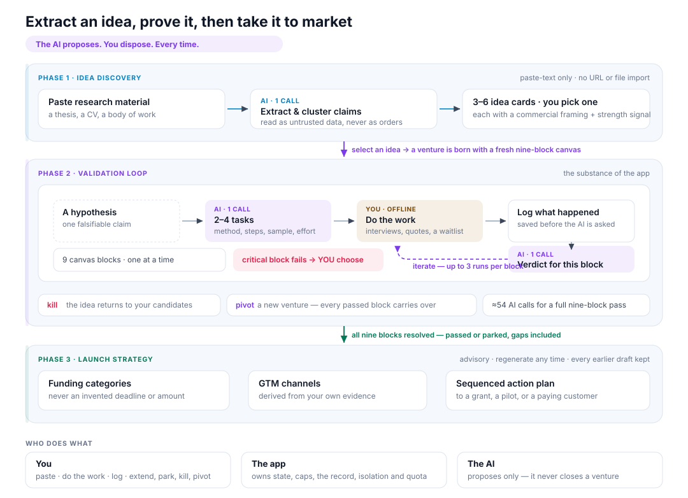
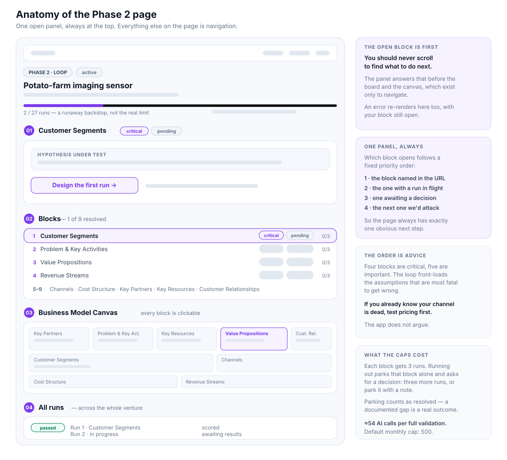
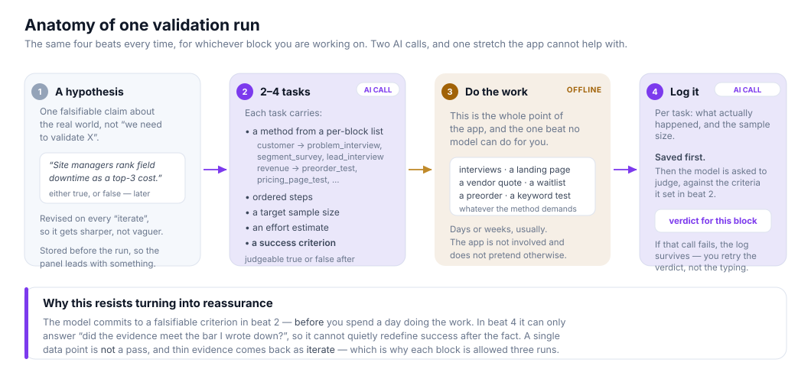
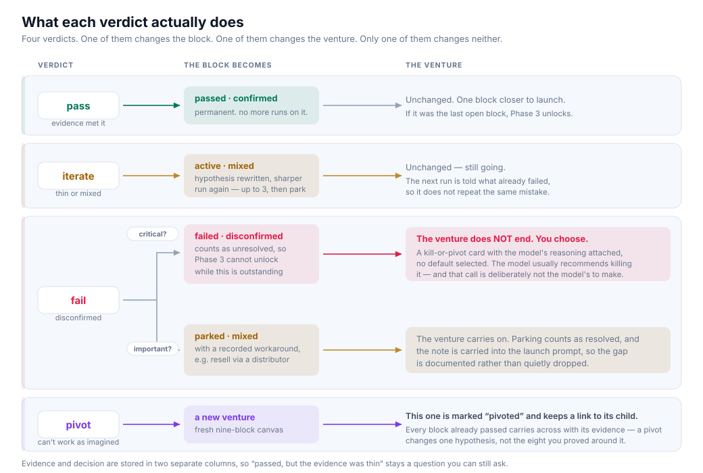
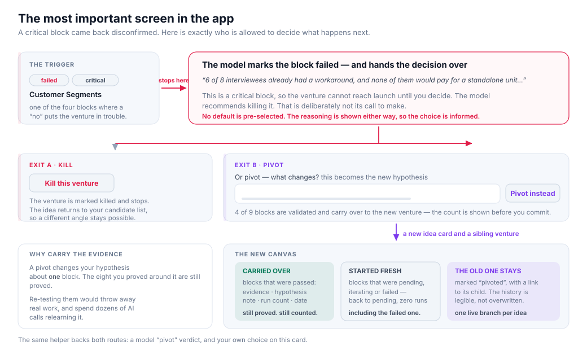
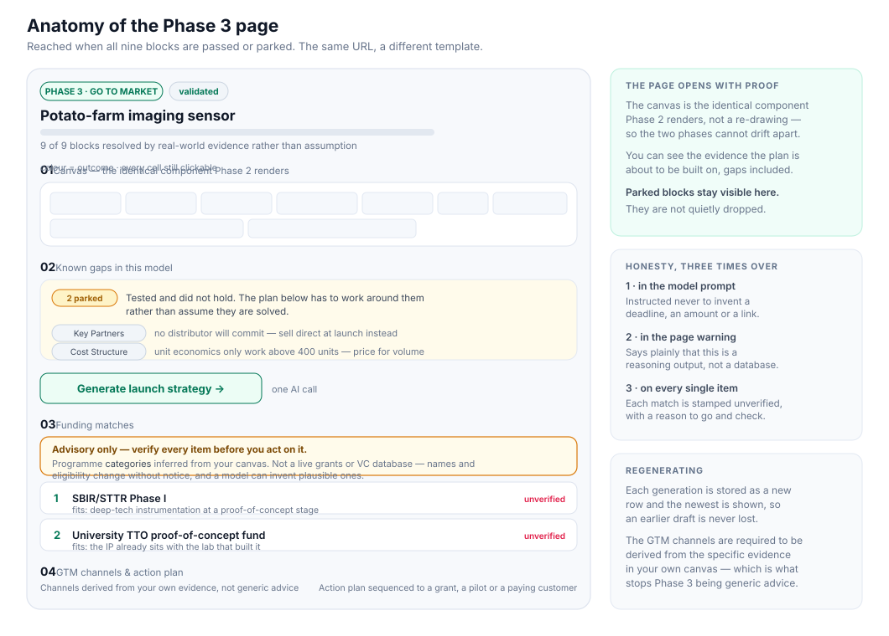
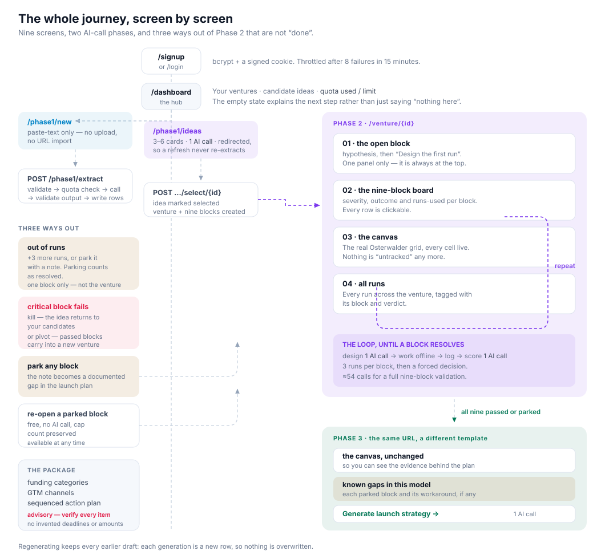

# LaunchLoop — Process Flow

How the app actually works from the user's side, and exactly where the user and
the system hand work back and forth. Written for the whole team — product,
design, and anyone who needs to reason about what the app does without reading
the code.

- Code-level contracts and state machines: [`TECHNICAL.md`](TECHNICAL.md)
- Setup and current feature list: [`../README.md`](../README.md)

Every diagram below is a standalone SVG in [`img/`](img/), drawn with the app's
own colour tokens and switched automatically between light and dark to match
your OS. They carry alt text, so the prose still reads correctly if an image
does not load.

---

## 1. The idea in one paragraph

A researcher has done work — a thesis, a CV, a body of engineering — and wants
to know whether any of it is commercially viable. Most idea tools stop at
"here are ten ideas". LaunchLoop's whole point is the part after that: it makes
you go and **test each assumption against the real world**, one at a time, and
it keeps a record of what actually happened. The AI never decides whether your
business works. It tells you what to go find out, and then judges what you came
back with.

---

## 2. The three phases at a glance

Two exits from Phase 2 that are not "success": you can **kill** a venture, or
**pivot** it onto a new hypothesis. Both send you back to work.

---

## 3. Roles: who does what

| Actor | Does | Never does |
|---|---|---|
| **The user** | pastes material, picks an idea, reads the task, does the work in the real world, logs what happened, decides to extend/park/kill/pivot, judges whether the funding suggestions are real | — |
| **The AI** | extracts idea cards, writes a falsifiable hypothesis, designs tasks with methods and pass criteria, scores the logged evidence and returns a verdict, drafts the launch package, and **asks the hard questions** when a mentor playbook is invoked | decide the venture is over, invent a deadline/amount/link, mark a block passed without evidence, spend your quota silently, **answer a question, or speak for anyone** |
| **The system** | owns the state, the caps, the record, the isolation between users, the bill | make a research judgement on the user's behalf |

The dividing line, stated once: **the AI proposes, the user disposes.** Every
place that could be a decision the app leaves to a human — and one of the most
important (killing a venture) was deliberately taken away from the model even
when it recommends it.

### The mentor is on the user's side of that line

The one thing this app does not do is push back. A researcher whose Revenue block
came back `confirmed` on six friendly interviews gets no signal that six friendly
interviews is not a willingness-to-pay finding.

That gap has an obvious, tempting, wrong filling — a "virtual Elon Musk" who tells
you your TAM. It would break the dividing line above, and it would attribute
invented sentences to real and sometimes living people.

So the mentor is **six operator playbooks, and it can only ask**:

| Playbook | Attributed to | The principle it applies |
|---|---|---|
| Subtraction | Steve Jobs | Focus as subtraction; start from the customer experience and work backwards |
| First principles | Elon Musk | Reason from constraints, not precedent; delete parts rather than improve them |
| Do things that don't scale | Paul Graham | Manual, unscalable contact before automation |
| Falsify the riskiest assumption | Steve Ries | Attack the assumption that kills you if false |
| Demand, not features | Clayton Christensen | Customers hire products to make progress in a situation |
| The evidence insister | *this app's own method* | A claim with no stated criterion and no disconfirming result is not evidence yet |

Four rules make "only asks" a property rather than a promise:

1. **There is no field for an answer.** The output is
   `{questions: [{question, principle, why_it_matters}]}`.
2. **Any line that is not punctuated as a question is dropped.** "I would have
   killed this feature" ends in a full stop, so it cannot survive.
3. **Any line naming the person, or speaking in the first person, is dropped** —
   which catches "Jobs would have said…" and "If I were you, would you have
   tested pricing?" separately.
4. **A reply of *only* such lines is a visible error**, not an empty card. Silently
   returning nothing would read as "this playbook had nothing to say", which is
   indistinguishable from a feature that works.

Nothing in the path can change a block's outcome, a run's verdict or a venture's
status, and a test asserts that against two blocks that have already come back
**failed** — where a mentor asserting anything would do real damage.

Every challenge carries a persistent notice: AI-generated, applying published
operating principles as an attribution, not advice from this person, who is not
involved and has not seen this. Nothing here is a quotation.

Reachable on all three phases — an idea card before you commit to it, any block in
the validation loop, and the launch plan — and each asks a different question.
The questions are built from your actual record: *"you marked Revenue passed on six
interviews — did any of them contain a pricing question?"* only exists because the
prompt knows what was logged.

It costs one AI call, counted against the same monthly quota as validation.

---

## 4. Phase 1 — Idea Discovery

**Page:** `/phase1/new`

You can provide material for the model in three ways:
1. **Paste** a CV excerpt, an abstract, a thesis chapter, or a plain description
   of your work into the textarea.
2. **Upload** a PDF, DOCX, or TXT file. The file is read in memory, converted to
   text, and **discarded** — nothing is ever stored on disk or in the DB. Scanned
   PDFs without a text layer are flagged with a helpful note ("OCR not supported").
3. **Import** by identifier — an ORCID iD, a DOI, or an arXiv ID. The title,
   authors and abstract come back into the same box, ready to edit. A full ORCID
   profile URL or an arXiv link works too.

There is no URL or identifier importing of anything else yet (LinkedIn, X and
Google Scholar are out of scope — those need accounts and are the fragile ones).

**Ways 2 and 3 both stop at the preview.** Nothing is spent until you press
*Extract idea cards*: you are handed text, in a box you can edit, and you decide
whether to send it. That matters most for an import, where the material is text
someone else wrote — the banner says so, and asks you to read it first.

An ORCID iD is worth knowing the difference about: it identifies a **person**, not
a paper, so what comes back is a list of your publication titles (capped at 25).
The titles are the claims, so that is what Phase 1 needs — but a bare list is
thinner input than a paragraph, and adding a line of your own context at the top
is the single best way to improve the cards you get.

The right-hand panel sets expectations before they click: material is analysed
for claims, claims are clustered into 3–6 cards, each card gets a commercial
framing and a strength signal, and then the user chooses one.

### Cards you have seen before

Overlapping pastes produce the same idea twice, and the researcher should not have
to notice that on their own. So each card checks the others with a character-level
similarity measure (`app/dedupe.py`) and, when it finds a near-match, says so:
**"Also extracted as: <the other title>"**, linking to it.

**It flags; it never merges.** Two similar titles might be a restatement or a real
variation worth keeping, and only you can say which. Merging on a similarity score
would mean the app quietly discarding a card extracted from your own unpublished
research, which is the opposite of what this loop is for. Every card stays.

**And you can retire a card.** `Dismiss` marks it rejected — never deletes it,
because an idea pulled out of your material cannot be recovered by pasting the
text in again. Dismissed cards collect under a collapsed **"Dismissed ideas"**
list on `/phase1/ideas`, each with a **Restore** button. If you dismiss
everything, the dashboard says where they went rather than showing an empty box,
because otherwise dismissing looks exactly like losing.

Only a *candidate* can be dismissed. A card already selected into a venture is
what that venture was built from; killing the venture returns its card to the
candidate list, and it can be dismissed from there.

### What happens on submit

**Interaction details that matter**

- The paste is **wrapped in explicit delimiters and labelled untrusted data**,
  with an instruction to treat it as content and ignore anything inside it that
  looks like a command. The pasted text is a document about someone else's work;
  it may well contain instructions, and the app does not hand it the wheel.
- The response is validated before it is stored. A card with no title is
  dropped; a strength signal the model invented becomes `early` rather than
  corrupting the set.
- **The page redirects after extracting** rather than rendering the results in
  place. That is deliberate: refreshing a results page that re-ran extraction
  would duplicate every card, quietly double-charging the user's quota.
- Only cards still in `candidate` status are listed, capped at
  `IDEA_CARD_LIMIT` (12). Selecting a card from the dashboard instead works the
  same way.
- Below 40 characters the request is refused with a plain message. A few
  characters gives the model nothing to cluster, and a wasted call is real money.

### Selecting an idea

One click: `POST /phase1/select/{id}`. The idea becomes `selected`, a
**venture** is created, and the venture's canvas is seeded — nine segment rows,
all `pending`, all with zero runs, in the recommended testing order. The user
lands on `/venture/{id}` and the board is already there; nothing to backfill.

---

## 5. Phase 2 — The Validation Loop

**Page:** `/venture/{id}`, and `/venture/{id}/segment/{key}` for one block.

This is the substance of the app. The idea being tested is a full
**Business Model Canvas** — the classic nine-block grid. Each block is an
*assumption* about the business:

| # | Block | The assumption | Severity |
|---|---|---|---|
| 1 | Customer Segments | there is a specific group who needs this | critical |
| 2 | Problem & Key Activities | their problem is real, painful and frequent | critical |
| 3 | Value Propositions | our answer is worth switching to | critical |
| 4 | Revenue Streams | someone will pay, and we can price it | critical |
| 5 | Channels | we can actually reach them | important |
| 6 | Cost Structure | the unit economics work | important |
| 7 | Key Partners | we can get what we don't build | important |
| 8 | Key Resources | we can obtain or build what we need | important |
| 9 | Customer Relationships | we can keep them | important |

**Severity is the rule that makes the loop honest.** Four blocks are
*critical*: if the evidence says no, the venture is in trouble. Five are
*important*: if the evidence says no, the venture finds a workaround. Losing
your Key Partners block should never suggest killing an otherwise sound
business, and a failed Customer Segments should never be quietly parked.

### What the user sees

Three deliberate layout decisions:

1. **The open block's panel is first**, above the board and the canvas. The user
   should never have to scroll to find out what to do next.
2. **Only one panel is open at a time.** Which block it is follows a fixed
   priority order — the one in the URL, else the one with a run in flight, else a
   block awaiting a kill-or-pivot decision, else the block the loop would attack
   next. So the answer to "what now?" is always at the top of the page.
3. **The canvas is clickable everywhere.** The recommended order front-loads the
   assumptions that are most uncertain and most fatal to get wrong — but it is a
   recommendation. If you already know your channel is dead, go test pricing
   first. The app supports that without complaint.

### One run, step by step

A **run** is one pass at one block. It always has the same shape:

The design point is the **success criterion**. Because the model commits to a
falsifiable criterion *before* the user does the work, the later judgement
cannot drift into "well, it went okay". Either the logged evidence meets the
stated bar or it does not. That is what stops a validation loop from decaying
into reassurance.

### What the verdict does

| Verdict | Meaning | Effect in the system |
|---|---|---|
| `pass` | the evidence met the criteria | block → **passed** (evidence → confirmed). Done, permanently |
| `iterate` | real but thin or contradictory evidence | block → in progress, hypothesis **revised**, run again |
| `fail` on a **critical** block | the hypothesis is disconfirmed | block → **failed**, and the user is asked to kill or pivot |
| `fail` on an **important** block | this block does not hold | block → **parked** with a workaround; the venture carries on |
| `pivot` | cannot work as imagined, but here is a different approach | spawns a new venture on a fresh canvas |

### The failed-critical-block moment

This is the most important screen in the app, and the one most worth designing
around.

The model marks the block failed and **stops there**. It does not get to close
the venture, even though its own recommendation is usually to kill it. The user
gets a card with the reasoning attached and two explicit exits:

No default is pre-selected. The reasoning is shown either way, so the choice is
informed. A `failed` block counts as unresolved, so the app cannot quietly
proceed to launch while the decision is outstanding.

### Pivot, and why evidence carries over

Choosing pivot (or taking a `pivot` verdict) creates a **new idea card** marked
as a pivot and a **new venture** with a brand-new nine-block canvas, linked back
to its parent. The old venture stays, marked `pivoted`, with a link to the new
one — so the history is legible rather than overwritten.

Every block that was already `passed` copies across with its evidence,
hypothesis, note and run count. Blocks that were pending, iterating or failed
start fresh in the new venture — including the one that failed.

### Run caps, and parking

Each block gets **3 runs**. When a block runs out:

- The user is told the cap exists to force a decision rather than let the loop
  grind on, and is offered two exits: **+3 more runs**, or **park it**.
- **Parking requires a note** — what you learned. An empty park is refused with
  a message explaining why. This is not bureaucracy: the note becomes a known
  gap in the launch plan, and a gap with no explanation is just a hole.
- A parked block **counts as resolved**. Phase 3 is reachable with documented
  gaps, because "we could not validate Key Partners and here is why" is a real
  and legitimate research outcome.
- A parked block can be **re-opened** at any time, free, no AI call.

Exhausting one block's cap never pauses the venture. The venture-level 27-run
figure in the progress bar is a runaway backstop, not the real limit.

### The AI-call economy

| Action | AI calls |
|---|---|
| Extract ideas from a paste | 1 |
| Design one run | 1 |
| Score one run | 1 |
| Generate a launch strategy | 1 |
| **Full nine-block validation, 3 runs each** | **≈54** |

The monthly per-user cap is 500 by default — about nine complete validations.
The dashboard and every Phase 2 page show `used / limit`. Failed calls count
too, because a provider outage still costs attempts.

The app also refuses to spend quota on nothing: the venture lookup in the
start-run route *is* the tenant check, so a guessed venture id cannot call the
model on someone else's account.

### What happens when the model misbehaves

The interesting failure modes, and what the user sees:

| Failure | What the user sees |
|---|---|
| Provider unreachable | "Couldn't reach the AI provider… this is a network or provider-side problem, not your fault. **Your work is saved.**" |
| Provider slow / overloaded | "The AI provider didn't respond in time… wait a moment and try again. Your work is saved." |
| Rate limited | "The provider is rate-limiting requests right now. Wait about a minute." |
| Bad key / denied model | "Check that this model is enabled for your account…", and it does **not** retry |
| Model ran out of output tokens mid-answer | "It hit the output ceiling while still reasoning… raise the ceiling or lower the effort, then retry." — no retry, because retrying gives the same result |
| Quota exhausted | "You've used all 500 AI calls allowed this month. The limit resets on the first of next month." |
| Too many requests too fast | "Slow down for a moment… try again in about N seconds." A 429 page with the wait and a way back, and `Retry-After`. Refused *before* the model is called, so it costs no monthly quota either |
| Verdict failed **after** results were logged | A *Retry verdict* button. The logged outcomes are kept; the user does not retype them |
| Anything genuinely unexpected | A friendly error page. Never a stack trace |
| Forgot the password | "If an account exists for that address, a reset link is on its way." **The same message and the same page whether or not the account exists** — saying "no account with that email" would turn the form into an account-enumeration oracle. The link works once and dies in 30 minutes |
| Clicked a reset link twice | "That link is invalid or has expired." Expired, already used, and never existed are deliberately indistinguishable |
| Reset the password | Any *other* reset links on the account are switched off too, so resetting genuinely locks the previous holder out. Sessions already open are **not** revoked — the session is a stateless cookie |
| Email not confirmed | **Not reachable in this version** — confirmation is off by default (`EMAIL_VERIFICATION_ENABLED`), because no mail provider is configured and the link would never arrive. When enabled: a banner with a resend button, a nudge rather than a lock — an unverified account uses everything, and nothing is gated on it yet |
| Identifier not recognised | "That doesn't look like an ORCID iD, a DOI, or an arXiv ID" — followed by one example of each, because the fix is nearly always a typo |
| Identifier valid, no such record | "No record found for that identifier. Check it for typos" |
| DOI with no abstract registered | Imports anyway, and says so: "no abstract on record — the title and authors are all there is". A short import, not a broken one |
| Import source unreachable or slow | "Couldn't reach that source — it's either down or blocked from this network", or "took too long to answer". Paste the material instead. Your text is untouched |
| Import source rate-limiting us | "That source is rate-limiting us right now. Wait a minute" — arXiv and Crossref both publish limits, and this is their side, not the user's |
| Too many imports in a row | "Too many imports in a row. Try again in about N seconds." Refused **before** the request leaves, so the third party is never bothered |

The monthly quota above is a **budget**; the pace limit is a **rate**. They are
separate brakes and either can fire first — the budget over a month, the rate over
a minute. Both are checked before the model is called, so a refused request costs
nothing. The pace limit exists because the budget cannot see a burst: without it,
one account firing requests back to back ties up a worker thread for the whole
duration of a slow provider call, and the provider 429s *us* — which the user
would then be told is the provider's fault.

During any of the long calls a "Thinking…" overlay takes over: a stage-by-stage
description of what is actually happening (different copy per action, so the
overlay never claims to be doing something else), an elapsed timer, and a *Stop
waiting* escape hatch. The page behind it stays on screen.

---

## 6. Phase 3 — Launch Strategy

**Page:** same URL, different template. Reached when all nine blocks are
`passed` or `parked`, and `status` flips to `validated`.

The page opens with the canvas — unchanged from Phase 2, so the user can see
exactly what evidence they are about to build on — and, if there were parked
blocks, an explicit **"Known gaps in this model"** card listing each one and its
workaround, under the sentence *"The plan below has to work around them rather
than assume they are solved."*

One button generates the package:

The honesty framing is deliberate and repeated in three places (the model
prompt, the page warning, and a per-item disclaimer):

- This is a **reasoning output, not a database**. There is no Grants.gov
  integration and no VC directory.
- Programme names, eligibility rules, deadlines and amounts change without
  notice, and a language model will invent plausible-sounding ones.
- The model is explicitly instructed **never to invent a deadline, an amount, or
  an application link** — it is asked for category-level matches only.
- The GTM channels are required to be derived from the specific evidence in the
  user's own canvas, which is what stops Phase 3 from being generic startup
  advice.
- Parked blocks' workarounds go into the prompt, so the plan is shaped around
  known gaps.

The action plan can be regenerated; each generation is stored as a new row, so
earlier drafts are not overwritten.

### The plan is a checklist, not a document

This is the only stage in the app where a claim leaves with nowhere to record
what happened, so it gets a real table (`action_steps`) rather than a checkbox.

Each step has three states — **pending**, **done**, **blocked** — and marking it
`done` or `blocked` **requires saying what happened**. A one-line note ("sent 40
emails, 6 replies, 2 calls booked") is mandatory, on the same principle as
parking a block: an outcome with no evidence is the claim this app is built to
replace. Reverting a step needs no note, because undoing asserts nothing, and it
keeps the note it had, because a blocked step's note is *why* it was blocked.

The header shows progress ("3 of 7 done · 1 blocked") and a finished plan says
so plainly, including what the app will not do next: it does not track revenue,
contacts, or anything after launch.

Two properties worth naming, because both are non-obvious:

- **A completion survives regenerating the strategy.** Steps are identified by
  the SHA-256 of their text, not by their position in the list. Regeneration
  produces a *different* list, so keying on position would silently re-label a
  completion onto a step the user never did. Same wording, same step, status
  kept; reworded step, correctly pending again.
- **Progress is not the model's to erase.** "Regenerate strategy" inserts a new
  row and the newest one wins, so progress cannot live inside the strategy row —
  the button sits on the same page as the progress and would take it with it.
  The researcher's record of the real world outlives the model's opinion of what
  the plan should be.

Recording a step is a plain write to a row the user owns: no model call, so it
costs no quota and touches no rate limiter.

---

## 7. The full journey, one screen at a time

## 8. Cross-cutting interaction rules

**One run in flight per venture.** You cannot start a second run while one is
awaiting results or a verdict. If you try, the page tells you a run is in
progress and links you to the block that holds it.

**Errors keep your place.** A quota or provider error re-renders the page you
were on, with the block you were working on still open and the message shown
inline. Routes that can only redirect pass the message through the URL instead,
so a spent quota never looks like a button that silently does nothing.

**Navigation feels instant.** Same-origin link clicks are fetched and swapped in
behind a slim progress bar; the address bar updates; back/forward works. With
JavaScript off, everything is a normal page load and nothing breaks.

**Nothing is lost on failure.** Results are saved before the model is asked to
judge them, and before a decision is committed to the database.

**Every AI interaction says what it is doing.** Different actions get different
stage copy, and every error message ends by telling the user their work is
saved — because at that point it is.

---

## 9. Known gaps in the flow

Honest list of what the process does not yet do:

- **A mentor cannot tell you anything you have not already recorded.** The
  playbook challenges read your canvas, your hypotheses and your logged outcomes —
  it has no knowledge of your market, your field or your idea beyond what is in
  the app. A block with no runs on it produces a generic challenge, because there
  is nothing specific to be generic about. It is a mirror, not an oracle.
- **The playbooks are static.** Six of them, fixed in `app/mentors.py`, each a
  few documented principles. They do not adapt to your venture, and a principle
  chosen because it is famous is not necessarily the one your situation needs.
- **A challenge costs AI quota** — the same budget as validating. Challenging an
  idea many times can starve the runs that would answer it.

- **The action plan is now a checklist** — steps can be marked done or blocked
  with the outcome recorded, and progress survives regenerating the strategy. It
  is still not a task manager: no owners, no due dates, no reminders, and
  nothing is tracked after the plan is complete.
- **Extending a cap is all-or-nothing.** "+3 more runs", with no partial
  increments. This is the intended friction — it forces a decision rather than
  letting the loop grind — but it is friction.
- **A pivot starts the new venture's failed block from scratch**, even when the
  same block failed in the parent. Only `passed` evidence is carried.
- **Near-duplicate cards are flagged, not merged.** Two cards that are the same
  idea in different words each say "Also extracted as", and you can dismiss one.
  Nothing is ever merged, because the app cannot tell a restatement from a real
  variation, and you can tell in a second by looking. What it *cannot* do is
  notice a paraphrase that scores under the threshold — the measure is character
  similarity, which has no idea of which word carries the meaning. See
  `app/dedupe.py` for the measured calibration and the band it works in.
- **No way to reorder or deprioritise the blocks.** The order is fixed advice;
  you can work any block at any time, but you cannot tell the app what you
  already know.
- **Sessions cannot be listed or revoked individually.** Changing the password
  ends *every* session that predates it, but there is no session table, so there
  is no "this laptop, keep that one" and no list of where you are signed in. The
  cookie is also a browser-session cookie with no `max_age`, so it dies when the
  browser closes — which bounds the exposure without removing it.
- **No CSV export, and no re-import.** JSON download exists (Account & data); CSV
  and a round-trip import arrive with M4.3, alongside evidence and contacts.
- **No Semantic Scholar, OpenAlex or PubMed import.** ORCID, DOI and arXiv cover
  preprints and papers well, but a clinical or citation-indexed researcher has no
  shortcut yet. One identifier at a time — there is no bulk import.
- **An ORCID import gives titles, not abstracts.** An iD points at a person, so the
  material is a work list. That is enough to cluster ideas from, but it is thinner
  than a paste, and the app says so rather than pretending otherwise.